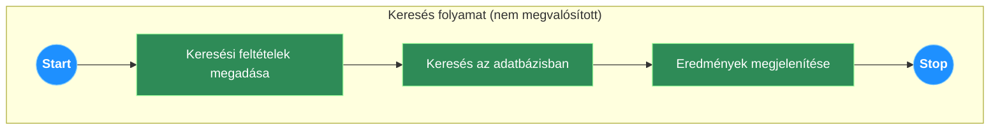
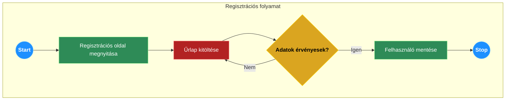
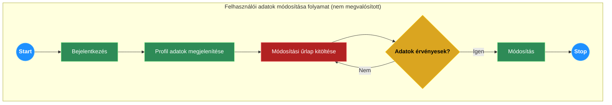
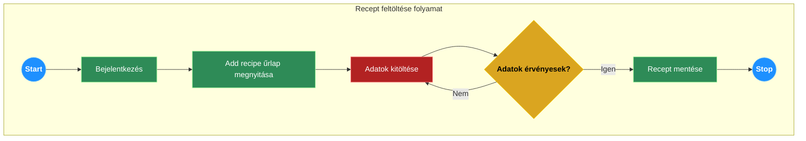
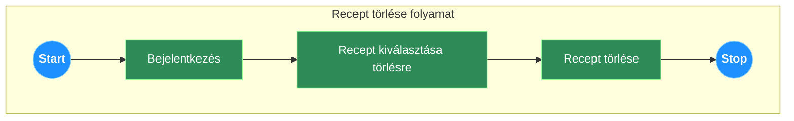
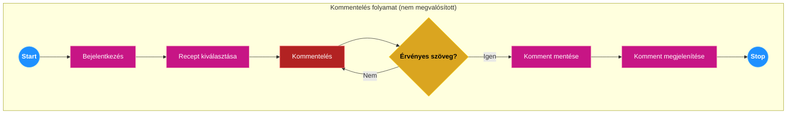
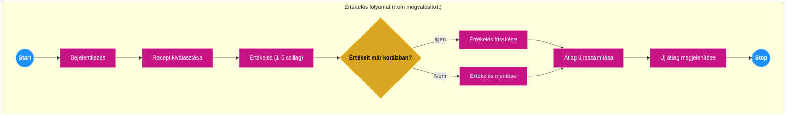
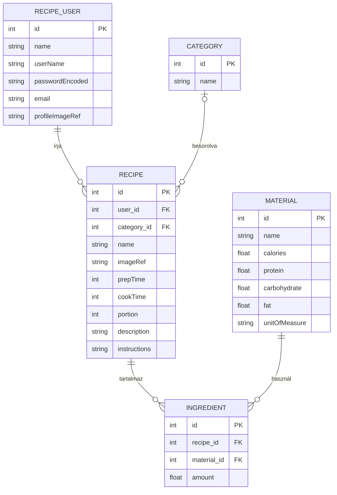

# Rendszerterv (megvalósított rendszerhez igazítva)

## 1. A rendszer célja

A projekt célja egy modern, felhasználóbarát receptmegosztó webalkalmazás létrehozása. A rendszer frontend–backend szétválasztott architektúrában működik: a backend egy Java Spring Boot alapú REST szolgáltatás, amelyet egy külön Blazor WebAssembly kliens használ.

A jelenlegi megvalósított verzió backend oldalon az alábbi fő funkciókat biztosítja:

- receptek létrehozása, listázása, kategória szerinti szűrése, azonosító szerinti lekérése és törlése,
- kategóriák listázása,
- alapanyagok (material) listázása,
- felhasználók regisztrációja és az aktuális bejelentkezett felhasználó adatainak lekérése.

A backend DTO alapú adatcserét használ, MapStruct mapperrel, és OpenAPI/Swagger dokumentációval rendelkezik. Az adattárolás MySQL relációs adatbázisban történik.

Nem megvalósított funkciók ebben a verzióban:

- kommentelés és csillagos értékelés,
- kedvencek kezelése,
- recept módosítása (PUT/PATCH),
- kategória és alapanyag adminisztráció (csak listázás érhető el),
- külső tápérték-számító API integráció.

## 2. Projektterv

### 2.1 Projektszerepkörök, felelősségek

A projekt agilis módszertan szerint, egy szorosan együttműködő csapatban valósul meg. A projekt előrehaladását és a feladatok kiosztását egy Kanban tábla segítségével követjük.

**Projektkoordinátor és Kanban menedzsment:** Csajbók-Reményi Korinna
- Feladata a csapatmunkát segítő Kanban tábla karbantartása, a feladatok állapotának nyomon követése, és a csapattagok közötti kommunikáció elősegítése.

**Fejlesztői csapat:**
- Pataricza György
- Deák Dániel
- Benkő Bence
- Németh Dávid
- Csajbók-Reményi Korinna

A csapat tagjai közösen felelősek a termékért, a prioritások meghatározásáért és a felmerülő akadályok elhárításáért.

### 2.2 Projektmunkások és felelősségeik

**Frontend:**
- **Deák Dániel:** A Blazor alapú projektváz kialakítása, a felhasználói felület komponenseinek implementálása.
- **Benkő Bence:** A felhasználói felület és felhasználói élmény megtervezése Figma szoftverrel.

**Backend:**
- **Pataricza György:** A Java Spring Boot projekt vázának létrehozása, az üzleti logikát megvalósító REST API végpontok fejlesztése, a Spring Security keretrendszer integrálása a felhasználói hitelesítéshez.
- **Németh Dávid:** Mock tesztek készítése.

**Adatbázis és Infrastruktúra:**
- **Benkő Bence:** Az adatbázis séma lekódolása MySQL adatbázishoz, a GitHub repository létrehozása és karbantartása.

**Dokumentáció és Tesztelés:**
- **Németh Dávid:** A funkcionális specifikáció és a rendszerterv elkészítése és karbantartása, valamint unit tesztek készítése.
- **Pataricza György:** A backend logikához tartozó BDD tesztek megírása.
- **A teljes csapat:** Integrációs és manuális tesztelés a fejlesztési ciklusok során a hibák felderítése érdekében.

### 2.3 Ütemterv

| Funkció / Story | Feladat / Task | Prioritás | Becslés (óra) |
|---|---|---|---|
| Funkcionális specifikáció | Elkészítés | 1 | 8 |
| Rendszerterv | Elkészítés | 1 | 8 |
| Infrastruktúra | GitHub repository és Kanban board létrehozása | 1 | 3 |
| Tervezés | UI/UX tervek elkészítése (Figma) | 1 | 12 |
| Adattárolás | Adatmodell megtervezése és séma lekódolása (MySQL) | 2 | 8 |
| Backend | Spring Boot projekt váz létrehozása | 2 | 4 |
| Backend | Felhasználói regisztráció és login (Spring Security) | 2 | 12 |
| Frontend | Blazor projekt váz létrehozása | 2 | 4 |
| Frontend | Főoldal, regisztrációs és bejelentkezési felület | 2 | 10 |
| Backend | Recept API-k (létrehozás, olvasás, törlés) | 3 | 10 |
| Frontend | Recept-lista és recept-részletező oldal | 3 | 12 |
| Backend | Komment, értékelés, kedvencek API-k | 3 | 12 |
| Frontend | Receptfeltöltő űrlap és közösségi funkciók | 3 | 14 |
| Backend | Külső kalória API integrálása | 4 | 8 |
| Tesztelés | Backend unit és integrációs tesztek | 3 | 16 |
| Tesztelés | Manuális E2E tesztelés | 4 | 12 |

### 2.4 Mérföldkövek

1. A Figma prototípus bemutatása.
2. Az alapvető backend API működőképessége (felhasználókezelés, recept API-k).
3. Az első, bejelentkezés nélküli felhasználók számára is használható verzió átadása (receptek böngészése).
4. A teljes funkcionalitású szoftver átadása.

## 3. Üzleti folyamatok modellje

### 3.1 Üzleti szereplők

- **Látogató:** A rendszert regisztrálás nélkül is lehet használni. Ekkor a látogató csak a nyilvános tartalmakat éri el, elsősorban receptek és törzsadatok lekérésére jogosult.
- **Regisztrált felhasználó:** A rendszer azon funkcióit éri el, amelyek autentikációhoz kötöttek, különösen recept feltöltése és törlése.

### 3.2 Üzleti folyamatok

#### Bejelentkezés minden regisztrált felhasználó számára ugyanolyan lefutású:

A kliensoldali bejelentkezési felületen a felhasználó megadja a felhasználónevét és jelszavát. Sikeres autentikáció esetén a backend Spring Security principal alapján azonosítja a felhasználót, és elérhetővé teszi a jogosultsághoz kötött API-kat.

#### Üzleti folyamatok regisztrált felhasználók számára:

**Új recept feltöltése:**
A felhasználó a recept feltöltő űrlapon megadja a recept adatait. Mentéskor a kliens `POST /recipe` kérést küld, a backend a receptet a bejelentkezett felhasználóhoz rendeli és elmenti.

| Megnevezés |
|---|
| Név |
| Kép (opcionális hivatkozás) |
| Kategória |
| Hozzávalók listája (alapanyag, mennyiség) |
| Elkészítés leírása / lépések |

**Recept törlése:**
A felhasználó a saját receptjét törölheti a `DELETE /recipe/{id}` végponton keresztül. A backend azonosító alapján törli a receptet és a kapcsolt ingredienteket.

#### Üzleti folyamatok látogatók számára:

**Regisztráció:**
A látogató `POST /user/register` kéréssel regisztrál. Foglalt felhasználónév esetén a backend hibaüzenetet ad vissza, siker esetén a felhasználó mentésre kerül.

**Keresés:**
A szöveges keresés a megvalósított backendben nem érhető el.

### 3.3 Üzleti entitások

- Recept
- Felhasználó (User)
- Kategória
- Alapanyag
- Hozzávaló

Komment és Kedvencek entitások nem részei a megvalósított verziónak.

## 4. Követelmények

### 4.1 Funkcionális követelmények

**Felhasználókra vonatkozó követelmények:**
A látogatók regisztráció nélkül böngészhetik a recepteket, kategóriákat és alapanyagokat. Regisztráció és bejelentkezés után recepteket tölthetnek fel és törölhetnek. Az aktuális felhasználó saját adatait le tudja kérdezni.

**Rendszerre vonatkozó követelmények:**
A rendszer REST API-n biztosítja a receptek és törzsadatok kezelését. A receptekhez képet (hivatkozásként), hozzávalókat, kategóriát és elkészítési leírást tud tárolni. Külső tápérték-API integráció nem része a jelenlegi verziónak.

### 4.2 Nemfunkcionális követelmények

#### Termék követelmények

**Használhatósági követelmények:** A backend szabványos REST API-kat biztosít, így bármely modern kliens könnyen integrálhatja.

**Megbízhatósági követelmények:** A tranzakciókezelés Spring Boot és Spring Data JPA rétegen keresztül történik, MySQL adatbázissal.

**Hatékonysági követelmények:** Az API válaszideje tipikus terhelés mellett alacsony késleltetésű.

**Hordozhatósági követelmények:** A backend Java alapú, bármely modern szerverkörnyezetben futtatható.

#### Szervezeti követelmények

**Implementációs követelmények:** Nyílt forráskódú technológiák használata (Java 21, Spring Boot 3, Blazor, MySQL).

#### Külső követelmények

**Titokvédelmi követelmények (GDPR):** A felhasználói adatok biztonságosan tároltak, a jelszavak hash-elve kerülnek mentésre.

**Biztonsági követelmények:** A hitelesítést Spring Security kezeli, BCrypt jelszóhash-eléssel. A publikus végpontok elérése whitelistben engedélyezhető.

### 4.3 Törvényi előírások, szabványok

- ISO / IEC 27001 – Információbiztonsági irányítási rendszerek
- ISO / IEC 12207 – Szoftver életciklus-folyamatok

## 5. Funkcionális terv

### 5.1 Rendszerszereplők

- **Látogató:** Böngészheti a recepteket és törzsadatokat, regisztrálhat.
- **Regisztrált felhasználó:** Receptek feltöltése és törlése, aktuális felhasználó lekérése.

### 5.2 Rendszerhasználati esetek és lefutásaik

A diagramok a tervezett folyamatokat mutatják. A megvalósított verzióban a regisztráció, recept feltöltés és recept törlés folyamatok támogatottak. Recept módosítás, kommentelés és értékelés a jelenlegi verzióban nem támogatott.















### 5.3 Határ osztályok

A backend határfelülete a REST API végpontok halmaza:

- `/user/register` – regisztráció
- `/user` – aktuális felhasználó lekérdezése
- `/recipe` – recept létrehozás és listázás
- `/recipe/{id}` – recept lekérdezés és törlés
- `/recipe/bycategory` – kategória szerinti szűrés
- `/category` – kategória listázás
- `/material` – alapanyag listázás

### 5.4 Menühierarchiák

A menürendszer a frontend kliens felelőssége. A backend nem tartalmaz menühierarchiát.

### 5.5 Képernyőtervek

A képernyőtervek Figma szoftverrel készültek. A frontend a backend API-khoz illeszkedik.

## 6. Fizikai környezet

### 6.1 Vásárolt softwarekomponensek és külső rendszerek

A projekt nyílt forráskódú technológiákra épül. Külső kalória és tápérték API integráció a jelenlegi verzióban nem készült el.

### 6.2 Hardver és hálózati topológia

Az alkalmazás egy standard kliens-szerver webes architektúrára épül.

- A felhasználók böngészővel érik el a Blazor WebAssembly klienst.
- A kliens HTTP kéréseket küld a Spring Boot backend számára.
- A backend MySQL adatbázishoz csatlakozik.

### 6.3 Fizikai alrendszerek

- **Webszerver:** A Spring Boot alkalmazásba beágyazott webszerver.
- **Adatbázis szerver:** MySQL.
- **Kliens:** Blazor WebAssembly alkalmazás böngészőben futtatva.

### 6.4 Fejlesztő eszközök

- **Backend IDE:** IntelliJ IDEA
- **Frontend IDE:** Visual Studio, JetBrains Rider, VS Code
- **Verziókezelés:** Git, GitHub
- **Tervezés:** Figma
- **Projektmenedzsment:** Kanban tábla
- **Adatbázis-kezelő:** DBeaver, MySQL Workbench

## 8. Architekturális terv

### 8.1 Architekturális tervezési minta

Az alkalmazás szétválasztott architektúrát követ. A frontend és a backend két különálló alkalmazás, amelyek REST API-n keresztül kommunikálnak JSON formátumban. A backend réteges architektúrát valósít meg (Controller–Service–Repository).

### 8.2 Az alkalmazás rétegei, fő komponensei, ezek kapcsolatai

```
Kliens (Felhasználói felület) <-----> Spring Boot REST API <-----> MySQL adatbázis
```

- **Kliens (Blazor):** Felhasználói felület, API hívások.
- **Webszerver (Spring Boot):** REST végpontok, üzleti logika, autentikáció, DTO mapping.
- **Adatbázis (MySQL):** Tartós adattárolás.

### 8.3 Változások kezelése

Minden üzleti logikát és adatkezelést érintő változás szerver oldalon történik. A kliens oldalon csak felület- és integrációs változtatások szükségesek.

## 9. Adatbázisterv

**User (RecipeUser) egyedet jellemzi:**
- id, name, userName, passwordEncoded, email, profileImageRef

**Recept (Recipe) egyedet jellemzi:**
- id, user_id (külső kulcs), category_id (külső kulcs), name, imageRef, prepTime, cookTime, portion, description, instructions

**Hozzávalók (Ingredient) egyedet jellemzi:**
- id, recipe_id (külső kulcs), material_id (külső kulcs), amount

**Alapanyag (Material) egyedet jellemzi:**
- id, name, calories, protein, carbohydrate, fat, unitOfMeasure

**Kategória (Category) egyedet jellemzi:**
- id, name

Komment és Kedvencek táblák nem részei a megvalósított adatmodellnek.

### 9.1 Logikai adatmodell



**Az adatbázis relációs sémái:**
- RecipeUser [ #id, name, userName, passwordEncoded, email, profileImageRef ]
- Category [ #id, name ]
- Material [ #id, name, calories, protein, carbohydrate, fat, unitOfMeasure ]
- Recipe [ #id, user_id, category_id, name, imageRef, prepTime, cookTime, portion, description, instructions ]
- Ingredient [ #id, recipe_id, material_id, amount ]

### 9.2 Tárolt eljárások

A rendszer nem használ tárolt eljárásokat.

### 9.3 Fizikai adatmodellt legeneráló SQL szkript

A táblákat létrehozó parancsok (MySQL szintaxis):

```sql
CREATE TABLE recipe_user (
    id BIGINT AUTO_INCREMENT PRIMARY KEY,
    name VARCHAR(255) NOT NULL,
    user_name VARCHAR(255) NOT NULL UNIQUE,
    password_encoded VARCHAR(255) NOT NULL,
    email VARCHAR(255) NOT NULL,
    profile_image_ref VARCHAR(255)
);

CREATE TABLE category (
    id BIGINT AUTO_INCREMENT PRIMARY KEY,
    name VARCHAR(255) NOT NULL UNIQUE
);

CREATE TABLE material (
    id BIGINT AUTO_INCREMENT PRIMARY KEY,
    name VARCHAR(255) NOT NULL UNIQUE,
    calories DOUBLE,
    protein DOUBLE,
    carbohydrate DOUBLE,
    fat DOUBLE,
    unit_of_measure VARCHAR(50)
);

CREATE TABLE recipe (
    id BIGINT AUTO_INCREMENT PRIMARY KEY,
    user_id BIGINT NOT NULL,
    category_id BIGINT,
    name VARCHAR(255) NOT NULL,
    image_ref VARCHAR(255),
    prep_time INT,
    cook_time INT,
    portion INT,
    description TEXT,
    instructions TEXT,
    CONSTRAINT fk_recipe_user FOREIGN KEY (user_id) REFERENCES recipe_user(id),
    CONSTRAINT fk_recipe_category FOREIGN KEY (category_id) REFERENCES category(id)
);

CREATE TABLE ingredient (
    id BIGINT AUTO_INCREMENT PRIMARY KEY,
    recipe_id BIGINT NOT NULL,
    material_id BIGINT NOT NULL,
    amount DOUBLE NOT NULL,
    CONSTRAINT fk_ingredient_recipe FOREIGN KEY (recipe_id) REFERENCES recipe(id) ON DELETE CASCADE,
    CONSTRAINT fk_ingredient_material FOREIGN KEY (material_id) REFERENCES material(id)
);
```

## 10. Implementációs terv

A Spring Boot backend tartalmazza az üzleti logikát és a REST API végpontokat. A frontend külön Blazor WebAssembly alkalmazás, amely a backendhez kapcsolódik.

### 10.1 Perzisztencia osztályok

JPA annotációzott entitások (RecipeUser, Recipe, Category, Material, Ingredient). Az adatbázis-műveleteket Spring Data JPA Repository interfészek végzik.

### 10.2 Üzleti logika osztályai

Spring Service osztályok:
- RecipeService
- CategoryService
- MaterialService
- MyUserDetailService

### 10.3 Kliens oldal osztályai

Blazor komponensek, amelyek REST API-n keresztül kommunikálnak.

## 11. Tesztterv

A tesztelés célja a megvalósított funkciók helyes működésének ellenőrzése.

A tesztelők között: **Németh Dávid**.

### 11.1 Tesztelt üzleti folyamatok (regisztrált felhasználó)

**Regisztráció:**
- Sikeres regisztráció egyedi adatokkal.
- Sikertelen regisztráció foglalt felhasználónévvel.

**Recept feltöltése:**
- Érvényes adatokkal sikeres mentés.

**Recept törlése:**
- Azonosító szerinti törlés.

### 11.2 Tesztelt üzleti folyamatok (minden felhasználó)

**Receptek böngészése:**
- Receptek listázása.
- Receptek szűrése kategóriára.
- Rezept lekérdezés id alapján.

**Törzsadatok:**
- Kategóriák listázása.
- Alapanyagok listázása.

## 12. Telepítési terv

### Szerver oldali telepítés:

- Szükséges Java futtatókörnyezet (JDK 21).
- A Spring Boot alkalmazás futtatható `.jar`-ként indul.
- MySQL adatbázis szükséges, csatlakozás a konfigurációban.
- Indítás: `java -jar app.jar`.

### Kliens oldali telepítés:

A Blazor WebAssembly alkalmazás modern böngészőben fut, külön telepítést nem igényel.
