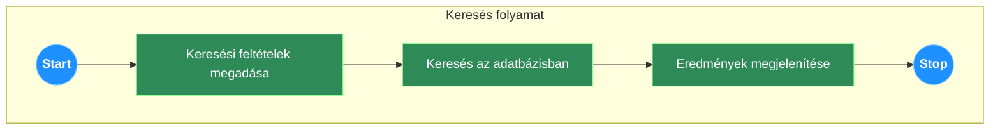
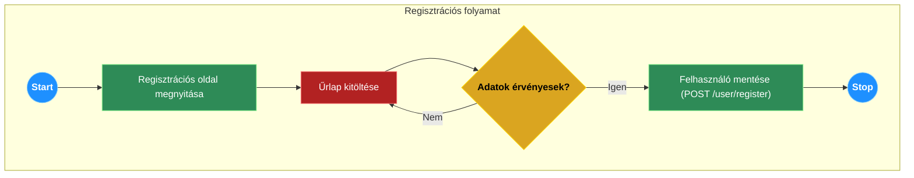
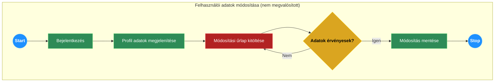
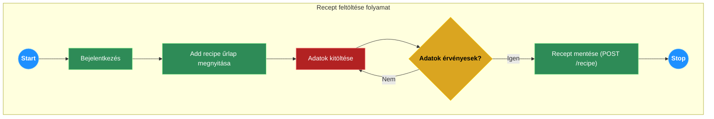
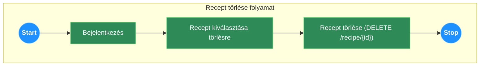
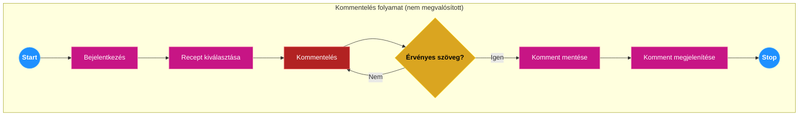
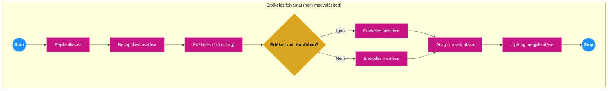
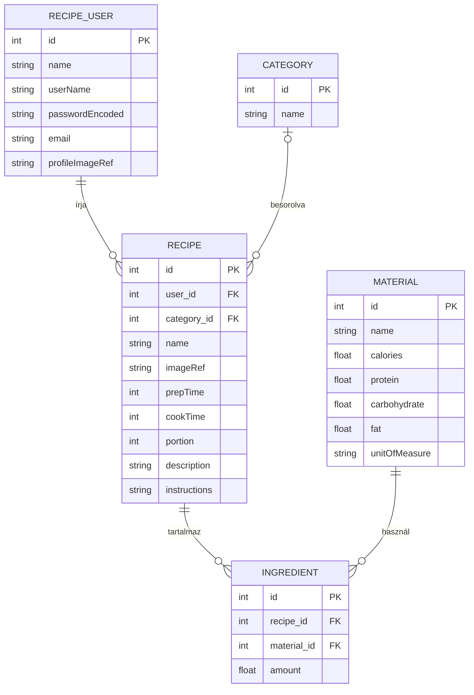

# Rendszerterv

## 1. A rendszer célja

A projekt célja egy modern, felhasználóbarát receptmegosztó webalkalmazás létrehozása. A rendszer frontend–backend szétválasztott architektúrában működik:

- **Backend:** Java Spring Boot alapú REST szolgáltatás
- **Frontend:** Blazor WebAssembly kliens (MudBlazor komponensekkel)

A jelenleg megvalósított verzió (V1.0) backend oldalon az alábbi fő funkciókat biztosítja:

- receptek létrehozása, listázása, kategória szerinti szűrése, azonosító szerinti lekérése és törlése,
- kategóriák listázása,
- alapanyagok (material) listázása,
- felhasználók regisztrációja,
- aktuális bejelentkezett felhasználó adatainak lekérése.

A backend DTO-alapú adatcserét használ (MapStruct mapper), és OpenAPI/Swagger dokumentációval rendelkezik. Az adattárolás MySQL relációs adatbázisban történik.

Nem megvalósított funkciók ebben a verzióban (az eredeti tervekhez képest):

- kommentelés és csillagos értékelés,
- kedvencek (favorites) kezelése,
- recept módosítása külön PUT/PATCH végponttal (update a POST /recipe-en keresztül történik),
- kategória és alapanyag adminisztráció (csak listázás érhető el),
- külső tápérték-számító API integráció (a tápértékek az alapanyag táblából származnak).

## 2. Projektterv

### 2.1 Projektszerepkörök, felelősségek

A projekt agilis módszertan szerint, egy szorosan együttműködő csapatban valósul meg. A projekt előrehaladását és a feladatok kiosztását egy Kanban tábla segítségével követjük.

**Projektkoordinátor és Kanban menedzsment: Csajbók-Reményi Korinna**
- Kanban tábla karbantartása
- feladatok állapotának nyomon követése
- csapattagok közötti kommunikáció támogatása

**Fejlesztői csapat tagjai:**
- Csajbók-Reményi Korinna
- Pataricza György
- Deák Dániel
- Benkő Bence
- Németh Dávid

A csapat tagjai közösen felelősek a termékért, a prioritások meghatározásáért és a felmerülő akadályok elhárításáért.

### 2.2 Projektmunkások és felelősségeik

**Backend**
- **Pataricza György**
    - Spring Boot projektváz létrehozása
    - REST API végpontok fejlesztése (receptek, kategóriák, alapanyagok, felhasználók)
    - Spring Security integráció (form login, jogosultságkezelés)
    - BDD (Cucumber) tesztek megírása
- **Németh Dávid**
    - Backend unit és MockMvc alapú controller tesztek írása
    - tesztlefedettség növelése
    - dokumentációk (funkcionális specifikáció, rendszerterv) aktualizálása a megvalósított rendszerhez

**Frontend**
- **Deák Dániel**
    - Blazor projektváz kialakítása
    - fő komponensek implementálása (Home, Recipe, Profil, Account, AddRecipe dialógus, CategoryFilter)
    - backend API-k integrálása
- **Benkő Bence**
    - UI/UX tervezés Figma-ban
    - DDT tesztesetek készítése a frontendre
    - felhasználói élmény finomhangolása
- **Csajbók-Reményi Korinna**
    - DDT tesztek tervezése és futtatása
    - kézi, exploratív tesztelés támogatása

**Adatbázis és infrastruktúra**
- **Benkő Bence**
    - adatbázis séma megtervezése és lekódolása MySQL-re
    - GitHub repository létrehozása és karbantartása

**Dokumentáció és tesztelés (összefoglaló)**
- Dokumentáció (funkcionális specifikáció, rendszerterv): Németh Dávid
- BDD tesztek: Pataricza György
- Frontend DDT tesztek: Benkő Bence, Csajbók-Reményi Korinna
- Rendszer- és integrációs tesztek: Deák Dániel
- Explorációs manuális tesztelés: teljes csapat

### 2.3 Ütemterv

Az eredeti terv funkcióalapú bontása:

| Funkció / Story | Feladat / Task | Prioritás | Becslés (óra) |
| :--- | :--- | :--- | :--- |
| Funkcionális specifikáció | Elkészítés | 1 | 8 |
| Rendszerterv | Elkészítés | 1 | 8 |
| Infrastruktúra | GitHub repo és Kanban board | 1 | 3 |
| Tervezés | UI/UX tervek (Figma) | 1 | 12 |
| Adattárolás | Adatmodell + MySQL séma | 2 | 8 |
| Backend | Spring Boot projektváz | 2 | 4 |
| Backend | Felhasználói regisztráció és login | 2 | 12 |
| Frontend | Blazor projektváz | 2 | 4 |
| Frontend | Főoldal, regisztrációs és bejelentkezési felület | 2 | 10 |
| Backend | Recept API-k (létrehozás, olvasás, törlés) | 3 | 10 |
| Frontend | Receptlista és recept-részletező oldal | 3 | 12 |
| Backend | Komment, értékelés, kedvencek API-k | 3 | 12 |
| Frontend | Közösségi funkciók UI | 3 | 14 |
| Backend | Külső kalória API integráció | 4 | 8 |
| Tesztelés | Backend unit és integrációs tesztek | 3 | 16 |
| Tesztelés | Manuális E2E tesztelés | 4 | 12 |

*Megjegyzés: a komment/értékelés/kedvencek és külső tápérték API funkciók az eredeti ütemtervben szerepelnek, de a V1.0 implementációban nem készültek el.*

### 2.4 Mérföldkövek

1. Figma prototípus elkészülése.
2. Alap backend API működőképessége (felhasználókezelés, recept API-k).
3. Első, bejelentkezés nélkül is használható verzió (receptek böngészése).
4. A V1.0 stabil, integrált kliens–szerver rendszer átadása.

## 3. Üzleti folyamatok modellje

### 3.1 Üzleti szereplők

- **Látogató (Guest):**
    - regisztráció nélkül böngészheti a recepteket,
    - megtekintheti a kategóriákat és alapanyagokat (közvetetten, a frontend hívásain keresztül).
- **Regisztrált felhasználó (User):**
    - minden látogatói jogkörrel rendelkezik,
    - belépés után recepteket hozhat létre, törölhet,
    - saját profiljához kötött recepteket kezelhet.

### 3.2 Üzleti folyamatok

**Bejelentkezés**
- A felhasználó a frontend menüből a bejelentkezés opciót választja.
- A Blazor kliens a Spring Security `GET /login` oldalára irányítja.
- A felhasználó megadja felhasználónevét és jelszavát.
- Sikeres autentikáció esetén a backend `JSESSIONID` sütit állít be, amely alapján azonosítja a további kérések során.

**Regisztráció**
- A látogató egy regisztrációs űrlapon megadja adatait (felhasználónév, e-mail, jelszó stb.).
- A kliens `POST /user/register` kérésben elküldi a regisztrációs adatokat.
- A backend ellenőrzi az adatok érvényességét, valamint a felhasználónév egyediségét.
- Siker esetén új `RecipeUser` rekord jön létre, a jelszó titkosítva tárolódik.
- Foglalt felhasználónév vagy hibás adatok esetén hibaüzenet kerül visszaküldésre.

**Új recept feltöltése**
- *Előfeltétel:* regisztrált, bejelentkezett felhasználó.
- A felhasználó az „Add recipe” akcióval megnyitja a receptfeltöltő űrlapot.
- A kliens előzetesen betölti:
    - kategóriák listáját (`GET /category`),
    - alapanyagok listáját (`GET /material`).
- A felhasználó megadja:
    - recept nevét,
    - kategóriát,
    - előkészítési/főzési időket,
    - adagok számát,
    - leírást,
    - hozzávalókat (alapanyag + mennyiség),
    - elkészítési lépéseket.
- Mentéskor a kliens `POST /recipe` kérést küld `RecipeDto`-val.
- A backend létrehozza a receptet, a hozzávalókat, és a bejelentkezett felhasználóhoz rendeli.

**Recept törlése**
- *Előfeltétel:* regisztrált, bejelentkezett felhasználó.
- A felhasználó kiválasztja a törölni kívánt saját receptet.
- A kliens a felhasználó megerősítése után `DELETE /recipe/{id}` kérésben küldi el a törlési igényt.
- A backend ellenőrzi a jogosultságot (tulajdonos-e), majd törli a receptet és a kapcsolódó hozzávalókat (ON DELETE CASCADE).

**Receptek böngészése**
- Látogató vagy regisztrált felhasználó a Home oldalon recepteket böngészhet.
- A kliens `GET /recipe` hívással betölti az összes receptet, majd kártyás nézetben jeleníti meg.

**Keresés és szűrés**
- A név szerinti keresés a frontenden kliensoldali szűrés a már lekért receptlistán (backend oldali kereső végpont nincs).
- A kategória szerinti szűrés `GET /recipe/bycategory?categoryId=...` hívással történik.

### 3.3 Üzleti entitások

- **Recept (Recipe)** – központi entitás, a felhasználóhoz és kategóriához kapcsolódik.
- **Felhasználó (RecipeUser)** – regisztrált user, aki recepteket ír.
- **Kategória (Category)** – recept kategorizálása (pl. Leves, Főétel, Desszert).
- **Alapanyag (Material)** – törzsadat, tápérték-információkkal.
- **Hozzávaló (Ingredient)** – kapcsoló entitás egy recept és egy alapanyag között, mennyiségi adattal.

*Komment és Kedvencek entitások nem részei a megvalósított verziónak.*

## 4. Követelmények

### 4.1 Funkcionális követelmények

**Felhasználókra vonatkozó követelmények:**

- **Látogatók regisztráció nélkül:**
    - receptek böngészése és részleteinek megtekintése,
    - kategóriák és alapanyagok adatainak lekérése (frontend felületén keresztül).
- **Regisztrált felhasználók:**
    - minden, amit a látogatók,
    - receptek feltöltése,
    - saját receptek törlése,
    - aktuális felhasználói adatok lekérése.

**Rendszerre vonatkozó követelmények:**

- A rendszer REST API-n keresztül teszi elérhetővé:
    - a receptek CRUD műveleteit (a módosítás jelenleg a `POST /recipe`-en keresztül történik),
    - a kategória- és alapanyag-törzsadatokat,
    - a felhasználók regisztrációját és az aktuális user lekérdezését.
- A receptekhez képet (URL), hozzávalókat, kategóriát és elkészítési leírást tud tárolni.
- Külső tápérték-API integráció nem része a jelenlegi verziónak.

### 4.2 Nemfunkcionális követelmények

**Termék követelmények**

- **Használhatóság:**
    - A backend szabványos, JSON-alapú REST API-kat biztosít.
    - A frontend reszponzív, modern webes felületet nyújt (Blazor + MudBlazor).
- **Megbízhatóság:**
    - Tranzakciókezelés Spring Data JPA rétegen keresztül, MySQL adatbázissal.
    - Üzleti logikát és perzisztenciát lefedő unit és integrációs tesztek.
- **Hatékonyság:**
    - A tipikus felhasználói műveletek (lista, részletek lekérése, mentés, törlés) alacsony válaszidővel futnak.
- **Hordozhatóság:**
    - Java alapú backend, amely bármely modern szerverkörnyezetben futtatható (JDK 21).
    - Blazor WebAssembly kliens, amely bármely modern böngészőben fut.

**Szervezeti követelmények**

- **Implementációs követelmények:**
    - Nyílt forráskódú technológiák (Java 21, Spring Boot 3, Blazor, MySQL).

**Külső követelmények**

- **Biztonság:**
    - Jelszavak hash-elve tárolódnak (BCrypt).
    - A hitelesítést Spring Security kezeli.
    - A publikus végpontok listája konfigurációval szabályozott.

### 4.3 Törvényi előírások, szabványok

- OpenAPI 3.0 a REST API dokumentálására.
- Általános adatvédelmi (GDPR) elvek betartása a felhasználói adatok kezelésénél.

## 5. Funkcionális terv

### 5.1 Rendszerszereplők

- **Látogató:**
    - Recepteket, kategóriákat, alapanyagokat tekinthet meg.
    - Regisztrálhat a rendszerbe.
- **Regisztrált felhasználó:**
    - Receptek feltöltése és törlése.
    - Saját adatok lekérése (aktuális felhasználói profil).

### 5.2 Rendszerhasználati esetek és lefutásaik

A diagramok a tervezett folyamatokat mutatják. A megvalósított verzióban regisztráció, recept feltöltés és recept törlés folyamatok támogatottak. Recept módosítás külön végponttal, kommentelés és értékelés a jelenlegi verzióban nem támogatott (a diagramokban tervezett funkcióként szerepelnek).















### 5.3 Határ osztályok

A backend határfelülete a REST API végpontok halmaza:

- `/user/register` – regisztráció
- `/user` – aktuális felhasználó lekérdezése
- `/recipe` – recept létrehozás és listázás (POST + GET)
- `/recipe/{id}` – recept lekérdezés és törlés
- `/recipe/bycategory` – kategória szerinti szűrés
- `/category` – kategóriák listázása
- `/material` – alapanyagok listázása

---

### 5.4 Menühierarchiák

**Bejelentkezés előtt:**

- Home
- Categories
- Register
- Login

**Bejelentkezett felhasználóként:**

- Home
- Categories
- Add recipe
- Profil (legördülő menü)
    - Profile
    - Logout

---

### 5.5 Képernyőtervek

A képernyőtervek Figma szoftverrel készültek.  
A frontend a backend API-khoz illeszkedik, a tényleges implementáció Blazor + MudBlazor komponensekre épül.

- **Home:** kártyás receptlista, keresősáv, kategóriaszűrő
- **Recipe details:** kép, leírás, hozzávalók, elkészítési mód
- **Profil:** felhasználói adatok és „My recipes” lista

---

## 6. Fizikai környezet

### 6.1 Vásárolt softwarekomponensek és külső rendszerek

A projekt nyílt forráskódú technológiákra épül:

- Java 21 + Spring Boot 3
- Blazor WebAssembly
- MySQL Community Server

Külső kalória- és tápérték-API integráció a jelenlegi verzióban **nem készült el**.

---

### 6.2 Hardver és hálózati topológia

Az alkalmazás standard kliens–szerver webes architektúrára épül:

- **Kliens:** böngésző, amely a Blazor WebAssembly klienst futtatja
- **Szerver:** Spring Boot REST API-t futtató szerver
- **Adatbázis:** MySQL szerver, amelyhez a backend csatlakozik

---

### 6.3 Fizikai alrendszerek

- **Webszerver:** a Spring Boot alkalmazásba beágyazott szerver (pl. Tomcat)
- **Adatbázis szerver:** MySQL
- **Kliens:** Blazor WebAssembly alkalmazás böngészőben

---

### 6.4 Fejlesztő eszközök

- Backend IDE: IntelliJ IDEA
- Frontend IDE: Visual Studio, JetBrains Rider, VS Code
- Verziókezelés: Git, GitHub
- Tervezőeszköz: Figma
- Projektmenedzsment: Kanban tábla
- Adatbázis-kezelő: DBeaver, MySQL Workbench

---

## 8. Architekturális terv

### 8.1 Architekturális tervezési minta

Az alkalmazás **szétválasztott architektúrát** követ.  
A frontend és backend két különálló alkalmazás, amelyek REST API-n keresztül, JSON formátumban kommunikálnak.  
A backend réteges architektúrát valósít meg (Controller–Service–Repository).

---

### 8.2 Az alkalmazás rétegei, fő komponensei, ezek kapcsolatai

Kliens (Blazor WebAssembly) <---- HTTP/JSON ----> Spring Boot REST API <----> MySQL adatbázis


**Kliens (Blazor):**

- Oldalak: Home, Recipe, Profil, Account
- Komponensek: NavMenu, AccountNavMenu, CategoryFilter, AddRecipeDialog, stb.
- Feladata: felhasználói interakciók kezelése, REST API hívások végrehajtása

**Webszerver (Spring Boot):**

- Controller réteg – REST végpontok (RecipeController, CategoryController, MaterialController, UserController)
- Service réteg – üzleti logika (RecipeService, CategoryService, MaterialService, MyUserDetailService)
- Repository réteg – Spring Data JPA repository-k (RecipeRepository, CategoryRepository, MaterialRepository, UserDetailsRepository)
- DTO mapping (MapStruct)

**Adatbázis (MySQL):**

- Relációs táblák: RecipeUser, Recipe, Category, Material, Ingredient
- Idegen kulcsok és kapcsolatok kezelése

---

### 8.3 Változások kezelése

- Az üzleti logikát érintő változások elsődlegesen a backend **Service** rétegében történnek.
- A perzisztenciaréteg (JPA entitások, repository-k) módosításával az adatmodell bővíthető (pl. komment, értékelés, kedvencek).
- A frontend a publikált OpenAPI definíció alapján módosítható; az API szerződés változása esetén elegendő a kliens által hívott végpontokat és DTO-kat szinkronban tartani.

---

## 9. Adatbázisterv

### 9.1 Egyedek (entitások)

**User (RecipeUser) egyedet jellemzi:**

- id
- name
- userName
- passwordEncoded
- email
- profileImageRef

**Recept (Recipe) egyedet jellemzi:**

- id
- user_id (külső kulcs RecipeUser-re)
- category_id (külső kulcs Category-ra)
- name
- imageRef
- prepTime
- cookTime
- portion
- description
- instructions (szöveges elkészítési leírás)

**Hozzávaló (Ingredient) egyedet jellemzi:**

- id
- recipe_id (FK Recipe)
- material_id (FK Material)
- amount (mennyiség)

**Alapanyag (Material) egyedet jellemzi:**

- id
- name
- calories
- protein
- carbohydrate
- fat
- unitOfMeasure

**Kategória (Category) egyedet jellemzi:**

- id
- name

> *Megjegyzés:* Komment és Kedvencek táblák **nem** részei a megvalósított adatmodellnek.

## 9. Adatbázisterv

### 9.1 Egyedek (entitások)

**Felhasználó (RecipeUser) egyedet jellemzi:**
- `id` (PK)
- `name`
- `userName`
- `passwordEncoded`
- `email`
- `profileImageRef`

**Kategória (Category) egyedet jellemzi:**
- `id` (PK)
- `name`

**Alapanyag (Material) egyedet jellemzi:**
- `id` (PK)
- `name`
- `calories`
- `protein`
- `carbohydrate`
- `fat`
- `unitOfMeasure`

**Recept (Recipe) egyedet jellemzi:**
- `id` (PK)
- `user_id` (FK)
- `category_id` (FK)
- `name`
- `imageRef`
- `prepTime`
- `cookTime`
- `portion`
- `description`
- `instructions`

**Hozzávaló (Ingredient) egyedet jellemzi:**
- `id` (PK)
- `recipe_id` (FK)
- `material_id` (FK)
- `amount`

### 9.2 Logikai adatmodell (ER diagram)



### 9.3 Fizikai adatmodellt legeneráló SQL szkript

A táblákat létrehozó parancsok (MySQL szintaxis):
```sql
CREATE TABLE recipe_user (
    id BIGINT AUTO_INCREMENT PRIMARY KEY,
    name VARCHAR(255) NOT NULL,
    user_name VARCHAR(255) NOT NULL UNIQUE,
    password_encoded VARCHAR(255) NOT NULL,
    email VARCHAR(255) NOT NULL,
    profile_image_ref VARCHAR(255)
);

CREATE TABLE category (
    id BIGINT AUTO_INCREMENT PRIMARY KEY,
    name VARCHAR(255) NOT NULL UNIQUE
);

CREATE TABLE material (
    id BIGINT AUTO_INCREMENT PRIMARY KEY,
    name VARCHAR(255) NOT NULL UNIQUE,
    calories DOUBLE,
    protein DOUBLE,
    carbohydrate DOUBLE,
    fat DOUBLE,
    unit_of_measure VARCHAR(50)
);

CREATE TABLE recipe (
    id BIGINT AUTO_INCREMENT PRIMARY KEY,
    user_id BIGINT NOT NULL,
    category_id BIGINT,
    name VARCHAR(255) NOT NULL,
    image_ref VARCHAR(255),
    prep_time INT,
    cook_time INT,
    portion INT,
    description TEXT,
    instructions TEXT,
    CONSTRAINT fk_recipe_user FOREIGN KEY (user_id) REFERENCES recipe_user(id),
    CONSTRAINT fk_recipe_category FOREIGN KEY (category_id) REFERENCES category(id)
);

CREATE TABLE ingredient (
    id BIGINT AUTO_INCREMENT PRIMARY KEY,
    recipe_id BIGINT NOT NULL,
    material_id BIGINT NOT NULL,
    amount DOUBLE NOT NULL,
    CONSTRAINT fk_ingredient_recipe FOREIGN KEY (recipe_id) REFERENCES recipe(id) ON DELETE CASCADE,
    CONSTRAINT fk_ingredient_material FOREIGN KEY (material_id) REFERENCES material(id)
);
```

---

## 10. Implementációs terv

**Webszerver (Spring Boot):**
- **Service réteg – üzleti logika:** `RecipeService`, `CategoryService`, `MaterialService`, `MyUserDetailService`
- **Repository réteg – Spring Data JPA:** `RecipeRepository`, `CategoryRepository`, `MaterialRepository`, `UserDetailsRepository`
- **Perzisztencia réteg – JPA entitások:** `RecipeUser`, `Recipe`, `Category`, `Material`, `Ingredient`

**Kliens oldal (Blazor WebAssembly):**
- **Oldalak:** `Home`, `Recipe`, `Profil`, `Account`
- **Komponensek:** `NavMenu`, `AccountNavMenu`, `CategoryFilter`, `AddRecipeDialog`, `EditRecipeDialog`
- **Állapotkezelés:** Keresési és szűrési állapotok kezelése
- **Kommunikáció:** HTTP kliens a backend REST API hívásához

---

## 11. Tesztterv

### 11.1 Tesztelési felelősök
- **Backend BDD tesztek (Cucumber):** Pataricza György
- **Backend unit és controller tesztek (JUnit, MockMvc):** Németh Dávid
- **Frontend DDT tesztek:** Benkő Bence, Csajbók-Reményi Korinna
- **Manuális rendszer- és integrációs tesztek:** Deák Dániel
- **Explorációs manuális tesztelés:** Teljes csapat

### 11.2 Tesztelt üzleti folyamatok (regisztrált felhasználó)
- **Regisztráció:**
    - Sikeres regisztráció egyedi adatokkal.
    - Sikertelen regisztráció foglalt felhasználónévvel.
- **Recept feltöltése:**
    - Érvényes adatokkal sikeres mentés.
    - Hibás adatok esetén megfelelő hibaüzenet.
- **Recept törlése:**
    - Recept törlése azonosító alapján.
    - Jogosultság ellenőrzése (csak saját recept törölhető).

### 11.3 Tesztelt üzleti folyamatok (minden felhasználó)
- **Receptek böngészése:**
    - Lista lekérése (`GET /recipe`).
    - Kategória szerinti szűrés (`GET /recipe/bycategory`).
    - Recept lekérdezése ID alapján (`GET /recipe/{id}`).
- **Törzsadatok:**
    - Kategóriák listázása (`GET /category`).
    - Alapanyagok listázása (`GET /material`).

---

## 12. Telepítési terv

### 12.1 Szerver oldali telepítés
1. JDK 21 telepítése.
2. MySQL adatbázis létrehozása és az SQL szkript futtatása.
3. Spring Boot alkalmazás konfigurálása (adatbázis elérés).
4. Alkalmazás indítása:
   ```bash
   java -jar app.jar
   ```

### 12.2 Kliens oldali telepítés
- A Blazor WebAssembly alkalmazás modern böngészőben fut, külön telepítést nem igényel.
- A frontend statikus fájlként vagy ASP.NET Core hostolt módon is kiszolgálható.
