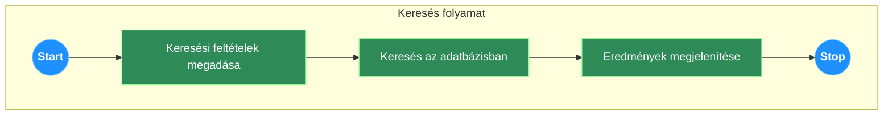
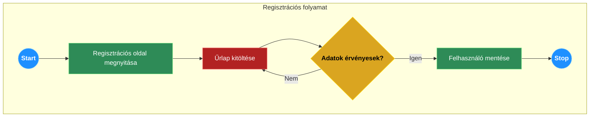
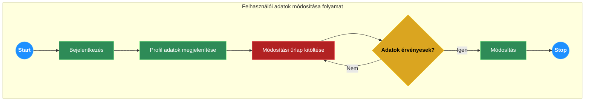
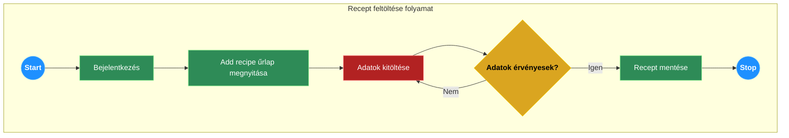
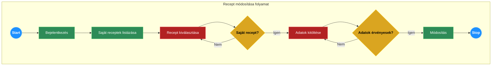
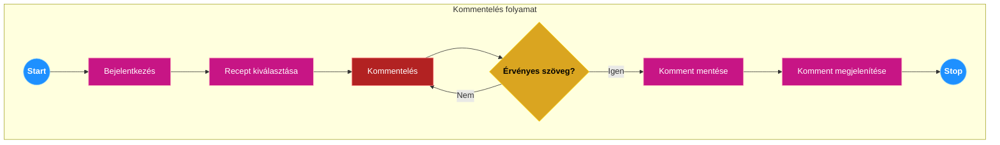
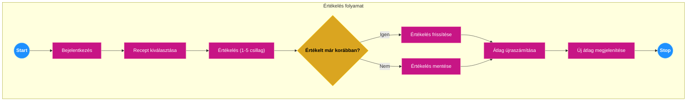

# Rendszerterv

## 1. A rendszer célja

A projekt célja egy modern, felhasználóbarát receptmegosztó weboldal létrehozása. A rendszer lehetővé teszi a felhasználók számára receptek feltöltését, böngészését, értékelését és kommentelését, valamint tápérték-információk megjelenítését egy külső API integrációjával, ezzel egy közösségi platformot teremtve a főzés iránt érdeklődők számára.

## 2. Projektterv

### 2.1 Projektszerepkörök, felelősségek

A projekt agilis módszertan szerint, egy szorosan együttműködő csapatban valósul meg. A projekt előrehaladását és a feladatok kiosztását egy Kanban tábla segítségével követjük.

**Projektkoordinátor és Kanban menedzsment:** Csajbók-Reményi Korinna
- Feladata a csapatmunkát segítő Kanban tábla karbantartása, a feladatok állapotának nyomon követése, és a csapattagok közötti kommunikáció elősegítése.

**Fejlesztői csapat:**
- Pataricza György
- Deák Dániel
- Benkő Bence
- Németh Dávid

A csapat tagjai közösen felelősek a termék leszállításáért, a prioritások meghatározásáért és a felmerülő akadályok elhárításáért.

### 2.2 Projektmunkások és felelősségeik

**Frontend:**
- **Deák Dániel:** A Blazor alapú projektváz kialakítása, a felhasználói felület komponenseinek implementálása.
- **Benkő Bence:** A felhasználói felület és felhasználói élmény megtervezése Figma szoftverrel.

**Backend:**
- **Pataricza György:** A Java Spring Boot projekt vázának létrehozása, az üzleti logikát megvalósító REST API végpontok (pl. receptek, kommentek kezelése) fejlesztése, a Spring Security keretrendszer integrálása a felhasználói hitelesítéshez.

**Adatbázis és Infrastruktúra:**
- **Benkő Bence:** Az adatbázis séma lekódolása SQLite adatbázishoz, a GitHub repository létrehozása és karbantartása.

**Dokumentáció és Tesztelés:**
- **Németh Dávid:** A funkcionális specifikáció és a rendszerterv elkészítése és karbantartása.
- **Pataricza György:** A backend logikához tartozó unit és BDD tesztek megírása.
- **A teljes csapat:** Integrációs és manuális tesztelés a fejlesztési ciklusok során a hibák felderítése érdekében.

### 2.3 Ütemterv

| Funkció / Story | Feladat / Task | Prioritás | Becslés (óra) |
|---|---|---|---|
| Funkcionális specifikáció | Elkészítés | 1 | 8 |
| Rendszerterv | Elkészítés | 1 | 8 |
| Infrastruktúra | GitHub repository és Kanban board létrehozása | 1 | 3 |
| Tervezés | UI/UX tervek elkészítése (Figma) | 1 | 12 |
| Adattárolás | Adatmodell megtervezése és séma lekódolása (SQLite) | 2 | 8 |
| Backend | Spring Boot projekt váz létrehozása | 2 | 4 |
| Backend | Felhasználói regisztráció és login API (Spring Security) | 2 | 12 |
| Frontend | Blazor projekt váz létrehozása | 2 | 4 |
| Frontend | Főoldal, regisztrációs és bejelentkezési felület | 2 | 10 |
| Backend | Recept CRUD API-k (létrehozás, olvasás, módosítás, törlés) | 3 | 10 |
| Frontend | Recept-lista és recept-részletező oldal | 3 | 12 |
| Backend | Komment, értékelés, kedvencek API-k | 3 | 12 |
| Frontend | Receptfeltöltő űrlap és közösségi funkciók | 3 | 14 |
| Backend | Külső kalória API integrálása | 4 | 8 |
| Tesztelés | Backend unit és integrációs tesztek | 3 | 16 |
| Tesztelés | Manuális E2E tesztelés | 4 | 12 |

### 2.4 Mérföldkövek

1. A Figma prototípus bemutatása.
2. Az alapvető backend API működőképessége (felhasználókezelés, recept CRUD).
3. Az első, bejelentkezés nélküli felhasználók számára is használható verzió átadása (receptek böngészése).
4. A teljes funkcionalitású szoftver átadása.

## 3. Üzleti folyamatok modellje

### 3.1 Üzleti szereplők

- **Látogató:** A rendszert regisztrálás nélkül is lehet használni. Ekkor a látogató csak a nyilvános tartalmakat éri el, elsősorban receptek keresésére és megtekintésére van jogosultsága.

- **Regisztrált felhasználó:** A rendszer teljes funkcionalitását a regisztrált felhasználók érik el, akik bejelentkezés után tartalmat tölthetnek fel (receptek), és interakcióba léphetnek más felhasználók tartalmaival (kommentelés, értékelés).

### 3.2 Üzleti folyamatok

#### Bejelentkezés minden regisztrált felhasználó számára ugyanolyan lefutású:

A 'Bejelentkezés' menüpontra kattintva megjelenik az 'E-mail cím' és 'Jelszó' beviteli űrlap. A mezők kitöltése után a 'Bejelentkezés' gombra kattint a felhasználó. Ha az azonosítás sikeres, akkor a felhasználó belépett és megjelenik a jogosultságának megfelelő menüsor. Ha nem sikerül az azonosítás, hibaüzenet jelenik meg.

#### Üzleti folyamatok regisztrált felhasználók számára:

**Új recept feltöltése:**
A felhasználó a 'Recept feltöltése' menüpontra kattint. A megjelenő űrlapon a recept alábbi táblázatban szereplő adatait felviszi. Ha befejezte az adatok felvitelét, a 'Recept mentése' gombra kattint. A rendszer ellenőrzi az adatok helyességét, és ha megfelelőek, akkor a receptet felveszi az adatbázisba, és létrehozza annak adatlapját.

| Megnevezés |
|---|
| Név |
| Kép |
| Kategória |
| Hozzávalók listája (alapanyag, mennyiség) |
| Elkészítés leírása |

**Recept értékelése és kommentelése:**
A felhasználó egy recept adatlapján a csillagok segítségével értékelést adhat (1-5), valamint szöveges kommentet írhat. A 'Küldés' gombra kattintva a rendszer elmenti a kommentet és az értékelést, összekapcsolva azt a felhasználóval és a recepttel.

**Recept törlése:**
A felhasználó a saját profil oldalán a 'Saját receptek' listából kiválasztja a törlendő receptet. A 'Törlés' gombra kattintva, egy megerősítést követően a rendszer véglegesen eltávolítja a receptet és a hozzá kapcsolódó adatokat (hozzávalók, kommentek) az adatbázisból.

#### Üzleti folyamatok látogatók számára:

**Regisztráció:**
A látogató a 'Regisztráció' menüpontra kattintva elkezdi a regisztrációs folyamatot. A megjelenő űrlapon megadja a nevét, e-mail címét és jelszavát. A 'Regisztráció' gombra kattintva a rendszer ellenőrzi az adatok érvényességét (pl. e-mail cím egyedisége). Sikeres validáció után a felhasználót felveszi az adatbázisba és automatikusan bejelentkezteti.

**Keresés:**
A felhasználónak nem szükséges belépnie a rendszerbe a funkció eléréséhez. A főoldali keresőmezőbe vagy a 'Receptek' oldalon beírja a keresendő szöveget (pl. recept neve, alapanyag), majd a 'Keresés' gombra kattint. A rendszer a találatokat listázza a képernyőn. Ha egy recept sem felel meg a keresési feltételnek, akkor a „Nincs találat." üzenet jelenik meg.

### 3.3 Üzleti entitások

- Recept
- Felhasználó (User)
- Komment
- Kategória
- Hozzávaló

## 4. Követelmények

### 4.1 Funkcionális követelmények

**Felhasználókra vonatkozó követelmények:**
A leendő felhasználóknak lehetősége van regisztráció nélkül keresni a receptek adatbázisában. Amennyiben a felhasználó regisztrál és bejelentkezik, elérhetővé válik számára a receptfeltöltés, a saját receptek kezelése, a kommentelés, az értékelés, valamint a kedvenc receptek listájának összeállítása. A felhasználó csak a saját profiladatait és receptjeit módosíthatja.

**Rendszerre vonatkozó követelmények:**
A rendszernek támogatnia kell a felhasználói fiókok létrehozását és a jelszóval védett bejelentkezést. A receptekhez képet, hozzávalókat, kategóriát és elkészítési leírást kell tudni tárolni. A hozzávalók alapján egy külső API segítségével tápértékadatokat kell megjeleníteni. A rendszernek biztosítania kell egy kereső funkciót, amely a receptek nevében és leírásában keres.

### 4.2 Nemfunkcionális követelmények

#### Termék követelmények

**Használhatósági követelmények:** A fejlesztésre kerülő szoftver a potenciális felhasználók számára könnyen tanulható és használható, modern, reszponzív webes felülettel rendelkezik.

**Megbízhatósági követelmények:** A kialakítandó rendszer webes felületen keresztül ér el adatbázist. Az adatbázis konkurens elérése biztosított, továbbá inkonzisztens állapotba kerülése normál használat mellett nem lehetséges.

**Hatékonysági követelmények:** Az oldalbetöltési és API válaszidőknek gyorsnak kell lenniük, a felhasználói élmény fenntartása érdekében. A rendszernek képesnek kell lennie több száz egyidejű felhasználó kiszolgálására is jelentős lassulás nélkül.

**Hordozhatósági követelmények:** A web-alapú architektúra biztosítja, hogy a rendszer platformfüggetlen legyen, és bármely modern böngészővel rendelkező eszközön (asztali gép, mobil) használható legyen.

#### Szervezeti követelmények

**Implementációs követelmények:** A rendszer nyílt forráskódú technológiákra épül (Java, Spring Boot, Blazor, SQLite), ami csökkenti a licencköltségeket. A fejlesztés a projekttervben meghatározott ütemezés szerint zajlik.

#### Külső követelmények

**Jogi követelmények**

**Titokvédelmi követelmények (GDPR):** A rendszernek meg kell felelnie az Általános Adatvédelmi Rendelet előírásainak. A felhasználók adatait biztonságosan kell tárolni, és biztosítani kell számukra a jogaik gyakorlását (pl. adatok törlése).

**Biztonsági követelmények:** A szoftverfejlesztés során a felhasználók számára biztonságos, Spring Security által kezelt, egy- vagy többlépcsős (OAuth2) beléptetési rendszer lesz implementálva. A jelszavakat kódolt (hashed) formában kell tárolni.

### 4.3 Törvényi előírások, szabványok

- ISO / IEC 27001 – Információbiztonsági irányítási rendszerek
- ISO / IEC 12207 – Szoftver életciklus-folyamatok

## 5. Funkcionális terv

### 5.1 Rendszerszereplők

A rendszerben két fő szereplőcsoportot különböztetünk meg:

- **Látogató:** Olyan felhasználó, aki nincs bejelentkezve a rendszerbe. Jogosultsága a nyilvános receptek böngészésére és keresésére terjed ki.
- **Regisztrált felhasználó:** Bejelentkezett felhasználó, aki az olvasási jogosultságok mellett teljeskörű írási jogosultsággal rendelkezik a saját tartalmai felett (receptek létrehozása, módosítása, törlése), valamint használhatja a közösségi funkciókat (kommentelés, értékelés, kedvencek).

### 5.2 Rendszerhasználati esetek és lefutásaik









### 5.3 Határ osztályok


### 5.4 Menühierarchiák

A menürendszer a weboldal fejlécében elhelyezett navigációs sávban épül fel.

**Bejelentkezés előtt:**
- Kezdőlap
- Receptek
- Regisztráció
- Bejelentkezés

**Bejelentkezett felhasználóként:**
- Kezdőlap
- Receptek
- Recept feltöltése
- Kedvenceim
- Profil (legördülő menü)
  - Profilom
  - Kijelentkezés

### 5.5 Képernyőtervek

A képernyőtervek Figma szoftverrel készülnek, amelyek vizuális prototípusként szolgálnak a fejlesztéshez. A tervek a projekt GitHub repozitóriumában érhetők el. A prototípus bemutatja a főbb oldalak (kezdőlap, recept oldal, profil, bejelentkezés) elrendezését és a felhasználói folyamatokat, de nem fed le minden lehetséges interakciót.

## 6. Fizikai környezet

### 6.1 Vásárolt softwarekomponensek és külső rendszerek

A projekt nyílt forráskódú technológiákra épül. Külső, harmadik féltől származó rendszerként egy kalória és tápérték API (pl. Edamam, CalorieNinjas) lesz integrálva. Ennek használata a lekérdezések számától függően díjköteles lehet.

### 6.2 Hardver és hálózati topológia

Az alkalmazás egy standard kliens-szerver webes architektúrára épül.

- A felhasználók az interneten keresztül, böngészővel érik el a rendszert.
- **Szerver oldalon:** Egy felhő alapú (pl. AWS, Azure, Heroku) vagy fizikai szerver, amelyen a Java futtatókörnyezet, a Spring Boot alkalmazás és az SQLite adatbázis fájl található.
- **Kliens oldalon:** Bármilyen asztali vagy mobil eszköz, amelyen modern webböngésző fut.

### 6.3 Fizikai alrendszerek

- **Webszerver:** A Spring Boot alkalmazásba beágyazott webszerver (pl. Tomcat) szolgálja ki a bejövő HTTP kéréseket.
- **Adatbázis szerver:** Az SQLite egy szerver nélküli, fájl-alapú adatbázis, így az adatbázis műveleteket egy library végzi közvetlenül az alkalmazás szerveren.
- **Kliens:** A felhasználó böngészője, amely letölti és futtatja a Blazor WebAssembly alkalmazást.

### 6.4 Fejlesztő eszközök

- **Backend IDE:** IntelliJ IDEA, Eclipse
- **Frontend IDE:** Visual Studio, JetBrains Rider, VS Code
- **Verziókezelés:** Git, GitHub
- **Tervezés:** Figma
- **Projektmenedzsment:** Trello, Jira (Kanban board)
- **Adatbázis-kezelő:** DBeaver, SQLiteStudio

## 8. Architekturális terv

### 8.1 Architekturális tervezési minta

Az alkalmazás egy modern, szétválasztott (decoupled) architektúrát követ. A frontend (Blazor WebAssembly) és a backend (Java Spring Boot) két különálló alkalmazás, amelyek egy RESTful API-n keresztül kommunikálnak egymással JSON formátumban. A backend réteges architektúrát (Controller-Service-Repository) valósít meg az MVC (Model-View-Controller) minta elvei alapján.

### 8.2 Az alkalmazás rétegei, fő komponensei, ezek kapcsolatai

```
Kliens (Felhasználói felület) <-----> Webszerver (Üzleti logika) <-----> Adatbázis (Adattárolás)
```

- **Kliens (Blazor):** A böngészőben futó réteg, amely felelős a felhasználói felület megjelenítéséért és a felhasználói interakciók kezeléséért. HTTP kéréseket indít a backend API felé.
- **Webszerver (Spring Boot):** A szerveren futó alkalmazás, amely tartalmazza az üzleti logikát. Felelős a REST API végpontok biztosításáért, a kérések validálásáért, a felhasználói hitelesítésért (Spring Security) és az adatbázis-műveletek vezérléséért.
- **Adatbázis (SQLite):** Az adatok tartós tárolásáért felelős réteg.

### 8.3 Változások kezelése

Minden üzleti logikát és adatkezelést érintő változás szerver oldalon, a Spring Boot alkalmazásban történik. A kliens oldalon (Blazor) csak a felhasználói felületet érintő változtatásokra van szükség. A két réteg szétválasztása lehetővé teszi a független fejlesztést és telepítést.

## 9. Adatbázisterv

**User (Felhasználó) egyedet jellemzi:**
- id, neve, email_cime, jelszava (kódolva), kep_referencia

**Recept egyedet jellemzi:**
- id, user_id (külső kulcs), kategoria_id (külső kulcs), nev, kep_referencia

**Hozzávalók egyedet jellemzi:**
- id, recept_id (külső kulcs), alapanyag_id (külső kulcs), mennyiseg

**Alapanyag egyedet jellemzi:**
- id, neve, kaloria, feherje, szenhidrat, zsir, mertekegyseg

**Komment egyedet jellemzi:**
- id, recept_id (külső kulcs), user_id (külső kulcs), datum, szoveg, ertekeles (1-5)

**Kedvencek egyedet jellemzi:**
- id, user_id (külső kulcs), recept_id (külső kulcs)

**Kategória egyedet jellemzi:**
- id, nev

### 9.1 Logikai adatmodell

#### Egyed-Kapcsolat diagram


#### Adatbázis séma


**Az adatbázis relációs sémái:**
- User [ #id, neve, email_cime, jelszava, kep_referencia ]
- Kategoria [ #id, nev ]
- Recept [ #id, user_id, kategoria_id, nev, kep_referencia ]
- Alapanyag [ #id, neve, kaloria, feherje, szenhidrat, zsir, mertekegyseg ]
- Hozzavalok [ #id, recept_id, alapanyag_id, mennyiseg ]
- Komment [ #id, recept_id, user_id, datum, szoveg, ertekeles ]
- Kedvencek [ #id, user_id, recept_id ]

### 9.2 Tárolt eljárások

A rendszer a jelenlegi terv szerint nem használ tárolt eljárásokat. Az üzleti logika teljes egészében az alkalmazásrétegben (Spring Boot) kerül megvalósításra.

### 9.3 Fizikai adatmodellt legeneráló SQL szkript

A táblákat létrehozó parancsok (SQLite szintaxis):

```sql
CREATE TABLE User (
    id INTEGER PRIMARY KEY AUTOINCREMENT,
    neve TEXT NOT NULL,
    email_cime TEXT NOT NULL UNIQUE,
    jelszava TEXT NOT NULL,
    kep_referencia TEXT
);

CREATE TABLE Kategoria (
    id INTEGER PRIMARY KEY AUTOINCREMENT,
    nev TEXT NOT NULL UNIQUE
);

CREATE TABLE Recept (
    id INTEGER PRIMARY KEY AUTOINCREMENT,
    user_id INTEGER NOT NULL,
    kategoria_id INTEGER NOT NULL,
    nev TEXT NOT NULL,
    kep_referencia TEXT,
    FOREIGN KEY (user_id) REFERENCES User(id) ON DELETE CASCADE,
    FOREIGN KEY (kategoria_id) REFERENCES Kategoria(id) ON DELETE SET NULL
);

CREATE TABLE Alapanyag (
    id INTEGER PRIMARY KEY AUTOINCREMENT,
    neve TEXT NOT NULL UNIQUE,
    kaloria REAL,
    feherje REAL,
    szenhidrat REAL,
    zsir REAL,
    mertekegyseg TEXT
);

CREATE TABLE Hozzavalok (
    id INTEGER PRIMARY KEY AUTOINCREMENT,
    recept_id INTEGER NOT NULL,
    alapanyag_id INTEGER NOT NULL,
    mennyiseg TEXT NOT NULL,
    FOREIGN KEY (recept_id) REFERENCES Recept(id) ON DELETE CASCADE,
    FOREIGN KEY (alapanyag_id) REFERENCES Alapanyag(id)
);

CREATE TABLE Komment (
    id INTEGER PRIMARY KEY AUTOINCREMENT,
    recept_id INTEGER NOT NULL,
    user_id INTEGER NOT NULL,
    datum TEXT NOT NULL,
    szoveg TEXT,
    ertekeles INTEGER CHECK(ertekeles >= 1 AND ertekeles <= 5),
    FOREIGN KEY (recept_id) REFERENCES Recept(id) ON DELETE CASCADE,
    FOREIGN KEY (user_id) REFERENCES User(id) ON DELETE CASCADE
);

CREATE TABLE Kedvencek (
    id INTEGER PRIMARY KEY AUTOINCREMENT,
    user_id INTEGER NOT NULL,
    recept_id INTEGER NOT NULL,
    FOREIGN KEY (user_id) REFERENCES User(id) ON DELETE CASCADE,
    FOREIGN KEY (recept_id) REFERENCES Recept(id) ON DELETE CASCADE,
    UNIQUE(user_id, recept_id)
);
```

**Megjegyzés:** Az SQLite nem rendelkezik a nagyobb adatbázis-kezelőkben megszokott felhasználói jogosultságkezeléssel. A jogosultságokat az alkalmazáslogika (Spring Security) és a fájlrendszeri hozzáférés-szabályozás biztosítja.

## 10. Implementációs terv

A webszerveren futó Java Spring Boot program tartalmazza az üzleti logikát. A felhasználói felület böngészőben megjelenő, Blazor technológiával készült WebAssembly alkalmazás. A programok objektumorientált programozási paradigmát követnek. Az adattárolásra SQLite adatbázist használunk.

### 10.1 Perzisztencia osztályok

Java entitás osztályok (POJO-k) JPA annotációkkal, amelyek leképezik az adatbázis tábláit (pl. User, Recept). Az adatbázis-műveleteket Spring Data JPA Repository interfészek végzik.

### 10.2 Üzleti logika osztályai

Spring Service osztályok (pl. ReceptService, UserService), amelyek a rendszer fő üzleti folyamatait és szabályait implementálják. Ezeket az osztályokat hívják meg a Controller-ek.

### 10.3 Kliens oldal osztályai

Blazor komponensek (.razor fájlok), amelyek a felhasználói felület egyes részeit definiálják. A C# code-behind fájlok kezelik a komponensek logikáját és a backend API-val való kommunikációt.

## 11. Tesztterv

A rendszerterv szerint implementált szoftver tesztelésének célja, hogy ellenőrizze az Üzleti folyamatok modellje című pontban meghatározott folyamatok helyes, specifikáció szerinti lefutását, valamint hogy a kliens webes felület felhasználóbarát módon jelenik meg és használható különböző böngészőkörnyezetekben.

A tesztelés során használt kliens hardverek a napjainkban elterjedt PC és mobil eszközök, amelyeken a leggyakrabban használt böngészőkön (Google Chrome, Mozilla Firefox, Microsoft Edge, Safari) teszteljük a rendszert.

### 11.1 Tesztelt üzleti folyamatok (regisztrált felhasználó)

#### A) Regisztráció és Bejelentkezés:

**Tesztesetek:**
- **Sikeres regisztráció érvényes, egyedi adatokkal.** 
  - *Elvárt eredmény:* A felhasználó létrejön az adatbázisban (kódolt jelszóval), a rendszer automatikusan bejelentkezteti.
- **Regisztráció már foglalt e-mail címmel.** 
  - *Elvárt eredmény:* Hibaüzenet jelenik meg, a felhasználó nem jön létre.
- **Sikeres bejelentkezés helyes e-mail/jelszó párral.** 
  - *Elvárt eredmény:* A felhasználó bejelentkezik, a menüsor frissül.
- **Sikertelen bejelentkezés hibás jelszóval.** 
  - *Elvárt eredmény:* Hibaüzenet jelenik meg, a felhasználó bejelentkezve marad.

#### B) Recept feltöltése:

**Tesztesetek:**
- **Recept feltöltése az összes kötelező mező (név, kategória, leírás) kitöltésével.** 
  - *Elvárt eredmény:* A recept létrejön, megjelenik a felhasználó profiljában és a nyilvános listákban.
- **Recept feltöltése hiányos adatokkal.** 
  - *Elvárt eredmény:* A rendszer hibaüzenetben jelzi a hiányzó mezőket, a recept nem kerül mentésre.

### 11.2 Tesztelt üzleti folyamatok (minden felhasználó)

#### A) Keresés:

**Tesztesetek:**
- **Keresés egy létező recept nevére.** 
  - *Elvárt eredmény:* A recept megjelenik a találati listában.
- **Keresés egy nem létező kulcsszóra.** 
  - *Elvárt eredmény:* "Nincs találat" üzenet jelenik meg.

#### B) Recept megtekintése:

**Tesztesetek:**
- **Egy recept adatlapjának megnyitása.** 
  - *Elvárt eredmény:* Minden adat (kép, hozzávalók, leírás, tápérték, kommentek) helyesen jelenik meg.
- **Komment szekció ellenőrzése (bejelentkezve vs. kijelentkezve).** 
  - *Elvárt eredmény:* Bejelentkezve megjelenik a kommentelő űrlap, kijelentkezve csak a meglévő kommentek láthatók.

## 12. Telepítési terv

### Szerver oldali telepítés:

- Szükséges egy Java futtatókörnyezet (JRE/JDK).
- A Spring Boot alkalmazás egy futtatható .jar fájlként kerül csomagolásra, amely tartalmazza a beágyazott webszervert is.
- A telepítés a .jar fájl szerverre másolásából és egy parancssori utasítással (`java -jar app.jar`) való elindításából áll.
- Az SQLite adatbázis egyetlen fájlként jön létre az alkalmazás mellett, külön adatbázis-szerver telepítése nem szükséges.

### Kliens oldali telepítés:

A szoftver webes felületéhez a felhasználóknak mindössze egy modern webböngészőre (pl. Google Chrome, Firefox, Edge) van szükségük. Külön szoftver telepítése a kliens gépekre nem kell.